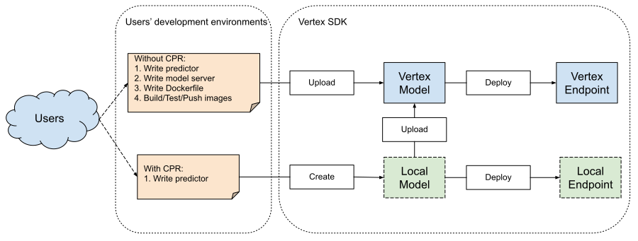

# Vertex AI Prediction: User guide for Custom Prediction Routines

**Kindly drop us a note before you run any scale tests.**

**Do not hesitate to contact vertexai-cpr-feedback@google.com if you have <ins>any</ins> questions or run into <ins>any</ins> issues.**


## Introduction

On Vertex AI Prediction, users are able to deploy models with either [Prediction’s pre-built containers](https://cloud.google.com/vertex-ai/docs/predictions/pre-built-containers) or [custom containers](https://cloud.google.com/vertex-ai/docs/predictions/use-custom-container). Pre-built containers handle prediction requests by performing the prediction operation of the machine learning framework. If users want to preprocess the prediction input before prediction is performed, or postprocess the model's prediction before returning the prediction result, then they have to build a custom container, which requires knowledge of model servers, Docker etc. To make building custom containers with pre and/or post processing significantly easier for our users, Vertex AI Prediction is launching Custom Prediction Routines (CPR) with Vertex SDK integration, which allows users to easily build custom containers with their own custom Predictor and locally test the built images through SDK.

## Setup

We recommend installing the Vertex AI SDK in a [virtualenv](https://virtualenv.pypa.io/en/latest/) using pip. [virtualenv](https://virtualenv.pypa.io/en/latest/) is a tool to create isolated Python environments and helps manage dependencies and versions, and indirectly permissions.

With [virtualenv](https://virtualenv.pypa.io/en/latest/), you can install the Vertex AI SDK without system install permissions, and avoid conflicts with the existing installed system dependencies.

### Mac/Linux
Specify `<your-env>` in the following snippets. `<your-env>` should be a string which will be the folder name of your environment.
```shell
pip install virtualenv
virtualenv <your-env>
source <your-env>/bin/activate
<your-env>/bin/pip install "google-cloud-aiplatform[prediction]>=1.16.0"
```

### Windows
Specify `<your-env>` in the following snippets. `<your-env>` should be a string which will be the folder name of your environment.
```shell
pip install virtualenv
virtualenv <your-env>
<your-env>\Scripts\activate
<your-env>\Scripts\pip.exe install "google-cloud-aiplatform[prediction]>=1.16.0"
```

## Design Overview

### User workflow overview



### A custom serving container using the CPR model server

Typically building a serving container requires writing model server code. However, with the Custom Prediction Routine feature, Vertex AI Prediction generates a model server while building images that can be used out of the box.

A custom serving container in this release contains the follow 3 pieces of code:
1. Model server
    - HTTP server that hosts the model
    - Responsible for setting up routes/ports/etc.
2. [Request Handler](https://github.com/googleapis/python-aiplatform/blob/main/google/cloud/aiplatform/prediction/handler.py)
    - Responsible for webserver aspects of handling a request, such as deserializing the request body, and serializing the response, setting response headers, etc.
    - Vertex Prediction also provides a default prediction handler `google.cloud.aiplatform.prediction.handler.PredictionHandler` in the SDK.
3. [Predictor](https://github.com/googleapis/python-aiplatform/blob/main/google/cloud/aiplatform/prediction/predictor.py)
    - Responsible for the ML logic for processing a prediction request, such as custom preprocessing and postprocessing.

Each of these three pieces can be customized based on the requirements of the custom container.

## Local Experience

We provide two classes for Custom Prediction Routine.
1. [Local Model](https://github.com/googleapis/python-aiplatform/blob/main/google/cloud/aiplatform/prediction/local_model.py)
    - Analogous to the local version of Vertex Model resource.
    - Created from either an existing image or a custom predictor.
    - Build custom containers from a given custom predictor.
    - Call `deploy_to_local_endpoint` to create a Local Endpoint.
    - Call `upload` to create a Vertex Model.
2. [Local Endpoint](https://github.com/googleapis/python-aiplatform/blob/main/google/cloud/aiplatform/prediction/local_endpoint.py)
    - Analogous to the local version of Vertex Endpoint resource.
    - Test prediction and/or health check against an image locally.

## User Journey

Upload the model artifacts to Google Cloud Storage before you start.

Write your own custom predictor by following [our predictor interface](https://github.com/googleapis/python-aiplatform/blob/main/google/cloud/aiplatform/prediction/predictor.py).

You can use [our default prediction handler](https://github.com/googleapis/python-aiplatform/blob/main/google/cloud/aiplatform/prediction/handler.py) or implement your own custom handler if you need by following [our handler interface](https://github.com/googleapis/python-aiplatform/blob/main/google/cloud/aiplatform/prediction/handler.py).

Then put all the code and an additional `requirements.txt` file, if you need to install any packages in your images, to a directory.

Use Vertex SDK to build custom containers.

```py
from google.cloud.aiplatform.prediction import LocalModel

# {import your predictor and handler}

local_model = LocalModel.create_cpr_model(
    {PATH_TO_THE_SOURCE_DIR},
    f"{REGION}-docker.pkg.dev/{PROJECT_ID}/{REPOSITORY}/{IMAGE}",
    predictor={PREDICTOR_CLASS},
    handler={HANDLER_CLASS},
    requirements_path={PATH_TO_REQUIREMENTS_TXT},
)
```

Check out the serving container spec of the built image.

```py
local_model.get_serving_container_spec()
```

Run and test the container locally. This step is required only if you want to test the container locally. If not, you can proceed directly to pushing the image to a registry. Here, we execute a prediction request and a health check.
```py
with local_model.deploy_to_local_endpoint(
    artifact_uri={GCS_PATH_TO_MODEL_ARTIFACTS},
    credential_path={PATH_TO_CREDENTIALS},
) as local_endpoint:
    predict_response = local_endpoint.predict(
        request_file={PATH_TO_INPUT_FILE},
        headers={ANY_NEEDED_HEADERS},
    )
    
    health_check_response = local_endpoint.run_health_check()
```

Print out the prediction response and health check response.
```py
print(predict_response, predict_response.content)
print(health_check_response, health_check_response.content)
```

Print out all the container logs.
```py
local_endpoint.print_container_logs(show_all=True)
```

Push the image to the registry after everything is ready to be deployed.
```py
local_model.push_image()
```

Upload to Vertex Model.
```py
from google.cloud import aiplatform

model = aiplatform.Model.upload(
    local_model=local_model,
    display_name={MODEL_DISPLAY_NAME},
    artifact_uri={GCS_PATH_TO_MODEL_ARTIFACTS},
)
```

Deploy the model to Vertex Endpoint.
```py
endpoint = model.deploy(machine_type="n1-standard-4")
```

## Notebook Samples

The samples below showcase the different ways you can deploy an iris model with custom pre/post-processing on Vertex AI Prediction.

The samples start with the simplest user journey (custom pre/post processing for sklearn). Each subsequent sample follows user journeys that allows for more flexibility during prediction handling. 

Each sample will also cover the local debugging experience.
- Custom Predictor with custom pre/post-processing for Sklearn, build your own container with Vertex SDK.
    - Implement only loading of serialized preprocessor, preprocess, and postprocess methods in the Predictor. Inherit default model loading and predict behavior from Vertex AI distributed SklearnPredictor.
    - https://github.com/GoogleCloudPlatform/vertex-ai-samples/blob/main/notebooks/community/prediction/custom_prediction_routines/SDK_Custom_Preprocess.ipynb
- Custom Predictor, build your own container with Vertex SDK.
    - Custom implementation of the entire Predictor.
    - https://github.com/GoogleCloudPlatform/vertex-ai-samples/blob/main/notebooks/community/prediction/custom_prediction_routines/SDK_Custom_Predict_SDK_Integration.ipynb
- Custom Predictor and Handler, build your own container with Vertex SDK.
    - Custom implementation of Predictor and Handler.
    - Customizing the Handler allows the model server to handle csv inputs.
    - https://github.com/GoogleCloudPlatform/vertex-ai-samples/blob/main/notebooks/community/prediction/custom_prediction_routines/SDK_Custom_Predict_and_Handler_SDK_Integration.ipynb
- Custom Predictor, build your own container with Vertex SDK for PyTorch.
    - Custom implementation of the Predictor.
    - https://github.com/GoogleCloudPlatform/vertex-ai-samples/blob/main/notebooks/community/prediction/custom_prediction_routines/SDK_Pytorch_Custom_Predict.ipynb
- Existing image, test prediction locally and deploy models with Vertex SDK.
    - Use NVIDIA Triton inference server for PyTorch models.
    - https://github.com/GoogleCloudPlatform/vertex-ai-samples/blob/main/notebooks/community/prediction/custom_prediction_routines/SDK_Triton_PyTorch_Local_Prediction.ipynb
